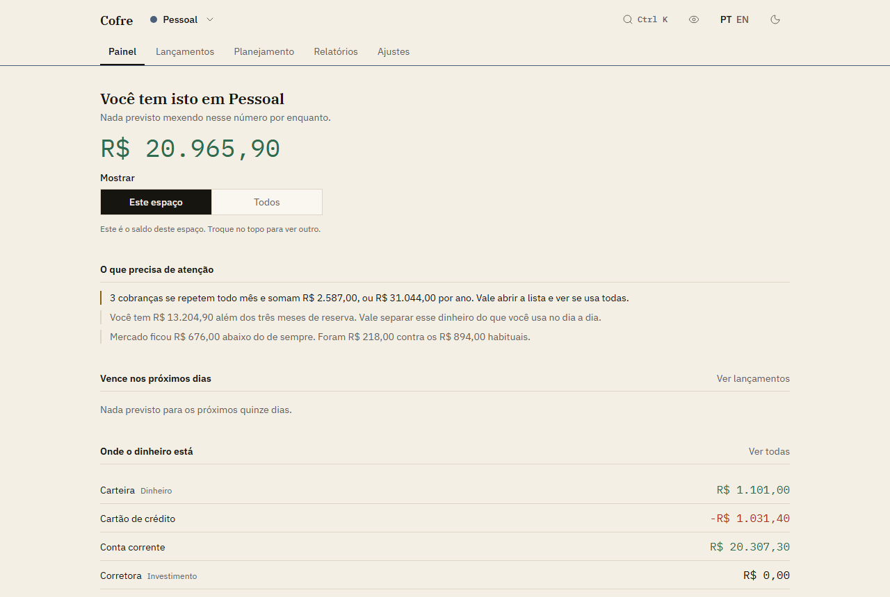

# Cofre Ink

Personal finance for one person, a couple, a family or a group of friends. You clone it,
you run it, and the database is yours: in your browser, on a server of your own, or on a
cloud you pay for. No account with anybody, no telemetry, nothing sent anywhere without
you pressing something.

The interface is in Portuguese and in English. Everything in the repository, including
this file, is in English.



## What it does

**Records.** Accounts, cards with a real invoice cycle, instalments, transfers, planned
and settled. A whole record written on one line: `mercado 42,90 ontem nubank 3x`.

**Sorting.** Categories two levels deep, spending priority, and rules that sort by
themselves and learn from a correction.

**Repeating.** Series that write their own records, and a calendar of what falls due.

**Planning.** Limits per category or per priority, a save first rule, goals with a date,
and a projection of the next months built from three things kept apart: what is already
written, what repeats, and what an ordinary month looks like.

**Sharing.** A space has members with roles. An expense splits evenly, by share or by
amount, and a settle up says who owes whom, once.

**Reading a statement.** CSV, OFX, QIF, XLSX and JSON, plus a PDF reader written by hand
for card invoices and receipts. The account is guessed and the guess says why. Columns
are remembered per file shape. Nothing is written before you have seen it.

**Saying something back.** Fifteen findings over your own records, each one carrying the
figures it was made from: a category well above its usual month, a budget being spent
faster than the month is passing, what repeats every month and what it comes to in a
year, a subscription that quietly went up, the same charge twice, a reserve measured in
months of ordinary spending. Nothing about what to buy or where to put money.

**Leaving.** Export everything as JSON or as a spreadsheet, restore it anywhere, keep a
copy in a file, a WebDAV folder or an online database, and mirror the records into a Google
spreadsheet. Two devices agree by exchanging a change log, over a server or through a
file somebody carries.

**Offline.** The whole interface is kept by a service worker, so it opens on a train.

## Running it

Node 22 or newer and pnpm 12 or newer.

```bash
pnpm install
pnpm dev
```

That is the browser mode: the database is a SQLite file inside your browser, there is no
account and nothing leaves the machine. There is no password either, so whoever opens
your browser sees your data. A public address exposes none of it: everybody who opens it
gets an empty Cofre Ink, inside their own browser.

For a server, with people and shared spaces:

```bash
cp .env.example .env    # then fill COFRE_SECRET
docker compose up -d
```

`docs/instalar.md` is the full guide, in Portuguese: publishing the browser mode on any
static host, a server with SQLite or PostgreSQL, backups, and where the data lives in
each mode.

## What is inside

```
apps/
  web/        React, Vite, TanStack Router and Query, Tailwind
  server/     Hono, Zod, Better Auth
packages/
  core/       business rules, plain TypeScript, no framework import
  db/         the schema described once, generated for SQLite and PostgreSQL
  storage/    the repository layer, four adapters, one permission model
  importers/  CSV, OFX, QIF, XLSX, JSON and PDF readers
  cloud/      where a copy can live, and the public indices
  ui/         design tokens, components, charts drawn as SVG
```

Four storage adapters, one suite. SQLite as WebAssembly in the browser, `node:sqlite` on
a server, PGlite and a real PostgreSQL. The same conformance suite runs against all of
them, including who is allowed to see what, which is how an adapter is declared
finished.

## Decisions

Every decision that is expensive to reverse is written down in `docs/adr`, with the
options that were rejected and why. Twenty two of them, from the monorepo to the way a
projection is built. A few that shape everything else:

1. **Money is always an integer number of minor units.** Never a floating point number.
2. **Every row carries a space, and the permission check is in the repository layer.**
   No screen and no route reads data without going through it.
3. **Business rules live in `packages/core`**, in plain TypeScript with no framework
   import, which is why they are the most heavily tested part of this.
4. **Nothing leaves the device without an explicit action**, and the interface says so
   when it is about to.
5. **No hyphen as punctuation** in anything written for a person, checked in CI.

## Tests

```bash
pnpm test        # 1190 across the packages
pnpm test:e2e    # 68 flows in a real browser
pnpm check       # lint, types, the writing rule and the two languages
```

The property tests use fast check. The browser flows use Playwright, including two
browsers that share nothing carrying a space to each other through a file, and one that
cuts the connection and reloads.

## Licence

MIT. See [LICENSE](LICENSE).
